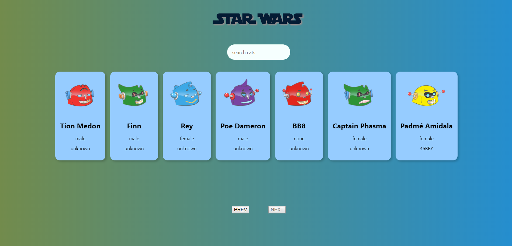

#  React App using Start Wars API
This project is a simple React app with redux and redux-thunk to get all characters of Star Wars using [SWAPI](https://swapi.co/) images used comes from Robohash API
## Libs
 - [Tachyons](http://tachyons.io/)
## API
 - [SWAPI](https://swapi.co/)
 - [RoboHash](https://robohash.org/)
 ## Screenshot



## What it does?
This App provides the follow functionalities:
 - A list of cards of characters loaded from the Star Wars API
 - A previous and next button to to show other character not listed on current page
 - Search box for that automatically updates for characters on page view

  # Get started

 ```
 $ git clone https://github.com/jakibenz/Star-Wars-Friends
 $ cd Star-Wars-Friends
 $ npm install
 $ npm start
 ```

 This project was bootstrapped with [Create React App](https://github.com/facebook/create-react-app).